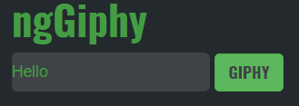

# NgGiphy
> A Giphy Search Experiment using Giphy API and Angular2.

## ScreenShot



## Index
  * [Required Sources](#required_sources)
  * [Installation](#installation)
  * [License](#license)

## Required Sources <a name="required_sources"></a>
* Giphy API - [GiphyAPI](http://api.giphy.com/v1/gifs/search?api_key=dc6zaTOxFJmzC&q=)
* Angular version2 - [Angular2](https://cli.angular.io/)

## Installation <a name="installation"></a>
  Clone or Download the repository

  ```
  $ git clone https://github.com/AakashKishan/ngGiphy.git
  $ cd ngGiphy
  ```

## License <a name="license"></a>
Built under [MIT](http://www.opensource.org/licenses/mit-license.php) license.